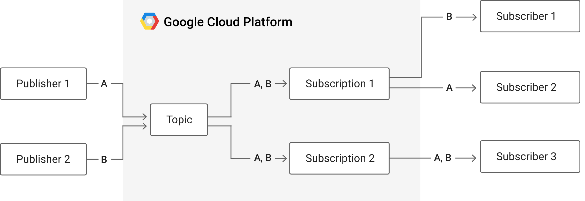
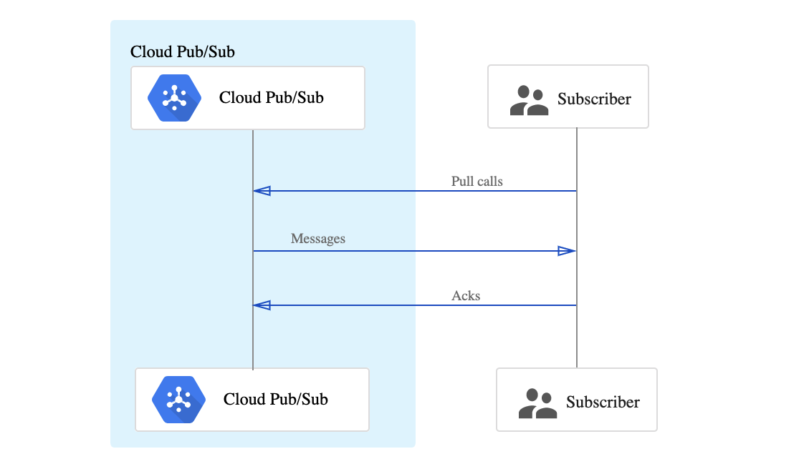
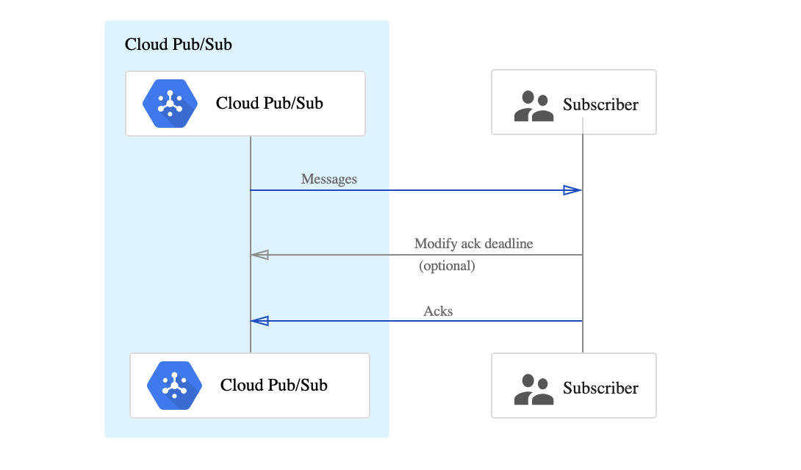

layout: true

.signature[@algogrit]

---

class: center, middle

# PubSub + Google Cloud Functions

Gaurav Agarwal

---
class: center, middle

Messaging and ingestion for event-driven systems and streaming analytics.

---

Use cases:

- Ingestion user interaction and server events

- Real-time event distribution

- Replicating data among databases

- Parallel processing and workflows

- Enterprise event bus

- Data streaming from IoT devices

- Load balancing for reliability

---

The Basics:

- Message: the data that moves through the service.

- Topic: a named entity that represents a feed of messages.

- Subscription: a named entity that represents an interest in receiving messages on a particular topic.

- Publisher (also called a producer): creates messages and sends (publishes) them to the messaging service on a specified topic.

- Subscriber (also called a consumer): receives messages on a specified subscription.

---
class: center, middle



---

- two publishers publishing messages on a single topic

- two subscriptions to the topic.

- first subscription has two subscribers,

  - with each subscriber receiving a subset of the messages

- second subscription has one subscriber
  - will receive all of the messages

- bold letters represent messages

---

## Judging Performance of a Messaging Service

- scalability

- availability

- latency

---
class: center, middle

### Scalability

---
class: center, middle

A scalable service should be able to handle increases in load without noticeable degradation of latency or availability.

---

"Load" can refer to:

- Number of topics

- Number of publishers

- Number of subscriptions

- Number of subscribers

- Number of messages

- Size of messages

- Rate of messages (throughput) published or consumed

- Size of backlog on any given subscription

---
class: center, middle

### Availability

---
class: center, middle

A system’s availability is measured on how well it deals with different types of issues, gracefully failing over in a way that is unnoticeable to end users.

---
class: center, middle

Failures can occur in hardware (e.g., disk drives not working or network connectivity problems), in software, and due to load.

---
class: center, middle

Availability can also degrade due to human error, where one makes mistakes in building or deploying software or configurations.

---
class: center, middle

### Latency

---
class: center, middle

Latency is a time-based measure of the performance of a system.

---
class: center, middle

A service generally wants to minimize latency wherever possible.

---

For Pub/Sub, the two most important latency metrics are:

- The amount of time it takes to acknowledge a published message.

- The amount of time it takes to deliver a published message to a subscriber.

---
class: center, middle

## Basic Architecture

---

- Pub/Sub servers run in all GCP regions around the world

- Pub/Sub’s load balancing mechanisms direct publisher traffic to the nearest GCP data center where data storage is allowed

- Pub/Sub is divided into two primary parts: the data plane, and the control plane

---
class: center, middle

*Data plane* handles moving messages between publishers and subscribers

---
class: center, middle

*Control plane* handles the assignment of publishers and subscribers to servers on the data plane

---
class: center, middle

The servers in the data plane are called *forwarders*, and the servers in the control plane are called *routers*.

---
class: center, middle

### Control Plane

---

- The Pub/Sub control plane distributes clients to forwarders in a way that provides scalability, availability, and low latency for all clients.

- Any forwarder is capable of serving clients for any topic or subscription.

- When a client connects to Pub/Sub, the router decides the data centers the client should connect to based on shortest network distance, a measure of the latency on the connection between two points.

- Within any given data center the router tries to distribute overall load across the set of available forwarders.

- A client takes this list of forwarders and connects to one or more of them.

---

The router must balance two different goals when assigning forwarders:

- uniformity of load

  - ideally every forwarder is equally loaded

- stability of assignments

  - ideally a change in load or a change in the set of available forwarders changes the smallest number of existing assignments

---
class: center, middle

### Data Plane

---
class: center, middle

The data plane receives messages from publishers and sends them to clients.

---

In general, a message goes through these steps:

- A publisher sends a message.

- The message is written to storage.

- Pub/Sub sends an acknowledgement to the publisher that it has received the message and guarantees its delivery to all attached subscriptions.

- At the same time as writing the message to storage, Pub/Sub delivers it to subscribers.

- Subscribers send an acknowledgement to Pub/Sub that they have processed the message.

- Once at least one subscriber for each subscription has acknowledged the message, Pub/Sub deletes the message from storage.

.content-credits[https://cloud.google.com/pubsub/architecture#data_plane_-_the_life_of_a_message]

---

- Different messages for a single topic and subscription can flow through many publishers, subscribers, publishing forwarders, and subscribing forwarders.

- Publishers can publish to multiple forwarders simultaneously and subscribers may connect to multiple subscribing forwarders to receive messages.

---
class: center, middle

The flow of messages through connections among publishers, subscribers, and forwarders can be complex.

---
class: center, middle

## Pub/Sub vs Pub/Sub Lite

---
class: center, middle

Pub/Sub and Pub/Sub Lite are both horizontally scalable, managed messaging services.

---

- Pub/Sub should be the default solution for most application integration and analytics use cases.

- Pub/Sub Lite is only recommended for applications where achieving extremely low cost justifies some additional operational work.

.content-credits[https://cloud.google.com/pubsub/docs/choosing-pubsub-or-lite#comparison_table]

---

- Pub/Sub routes messages globally

- Pub/Sub topics and subscriptions are global resources

- Pub/Sub scales automatically

- Pub/Sub supports multiple message delivery modes

- Pub/Sub uses per-message parallelism

---
class: center, middle

## Integrating with Cloud Functions

---
class: center, middle

*Demo*: Consume messages using `BackgroundFunction`

---
class: center, middle

## Publishing messages to topics

---
class: center, middle

A publisher application creates and sends messages to a topic

---

Pub/Sub offers:

- [at-least-once](https://cloud.google.com/pubsub/docs/subscriber#at-least-once-delivery) message delivery

- best-effort ordering to existing subscribers

---

The general flow for a publisher:

- Create a message containing your data

- Send a request to the Pub/Sub Server to publish the message to the desired topic

---
class: center, middle

### Message format

---

A message consists of:

- The message data

- An ordering key

- Attributes with additional metadata

---
class: center, middle

If you're using the REST API, the message data must be base64-encoded.

---

The Pub/Sub service adds the following fields to the message:

- A message ID unique to the topic

- A timestamp for when the Pub/Sub service receives the message

---

### Using client libraries to publish

- [Java library](https://github.com/googleapis/java-pubsub)

- [Go library](https://pkg.go.dev/cloud.google.com/go/pubsub)

- ...

.content-credits[https://cloud.google.com/pubsub/docs/quickstart-client-libraries]

---

While publishing messages, you can:

- Set your [own attributes](https://cloud.google.com/pubsub/docs/publisher#using_attributes)

- Specify a [ordering key](https://cloud.google.com/pubsub/docs/publisher#using_ordering_keys)

- Specify a [schema for messages](https://cloud.google.com/pubsub/docs/publisher#using_schema)

  - given you [have a schema](https://cloud.google.com/pubsub/docs/schemas)

  - and [specified the schema while creating the topic](https://cloud.google.com/pubsub/docs/admin#schemas)

---

[Schema Types](https://cloud.google.com/pubsub/docs/schemas#schema_types)

- [Apache Avro](https://avro.apache.org/docs/current/spec.html#schemas)

- [Protocol Buffer](https://developers.google.com/protocol-buffers/docs/overview)

---
class: center, middle

*Exercise*: Transforming and forwarding a message arriving on a PubSub topic

---
class: center, middle

## Subscriber Applications

---
class: center, middle

A subscription can use either the pull or push mechanism for message delivery.

---
class: center, middle

### Pull subscription



---

In pull delivery, your subscriber application initiates requests to the Pub/Sub server to retrieve messages.

- The subscribing application explicitly calls the pull method, which requests messages for delivery.

- The Pub/Sub server responds with the message (or an error if the queue is empty) , and an ack ID.

- The subscriber explicitly calls the acknowledge method, using the returned ack ID to acknowledge receipt.

---
class: center, middle

### Push subscription



---

In push delivery, Pub/Sub initiates requests to your subscriber application to deliver messages.

- The Pub/Sub server sends each message as an HTTPS request to the subscriber application at a pre-configured endpoint.

- The endpoint acknowledges the message by returning an HTTP success status code. A non-success response indicates that the message should be resent.

---
class: center, middle

By default, subscriptions expire after 31 days of inactivity

---
class: center, middle

### Subscribing to topics with schema

---

The subscriber can determine the schema settings associated with a topic by looking at two attributes:

- `googclient_schemaname`: The name of the schema used for validation. If the schema has been deleted, the name is `_deleted-schema_`

- `googclient_schemaencoding`: The encoding of the message, either JSON on BINARY

---
class: center, middle


---
class: center, middle

## Best Practices

---
class: center, middle

### Batching messages to increase message throughput

.content-credits[https://cloud.google.com/pubsub/docs/publisher#batching]

---
class: center, middle

The Pub/Sub client libraries can batch multiple messages into a single call to the service.

---

Messages can be batched based on:

- request size (in bytes): `ByteThreshold`

- number of messages: `CountThreshold`

- time: `DelayThreshold`

---
class: center, middle

Larger batch sizes increase message throughput (rate of messages sent per CPU).

--
class: center, middle

The cost of batching is latency for individual messages, which are queued in memory until their corresponding batch is filled and ready to be sent over the network.

---
class: center, middle

To minimize latency, batching should be turned off.

---
class: center, middle

### [Retrying requests](https://cloud.google.com/pubsub/docs/publisher#retry)

---
class: center, middle

Publishing failures are automatically retried, except for errors that do not warrant retries

---
class: center, middle

Retry settings control how the Pub/Sub client libraries retry publish requests.

---

The client libraries have *any of the following* retry settings:

- Initial request timeout: the amount of time before a client library stops waiting for the initial publish request to complete.

- Retry delay: the amount of time after a request times out that a client library waits to retry the request.

- Total timeout: the amount of time after a client library stops retrying publish requests.

---
class: center, middle

### Flow control

.content-credits[https://cloud.google.com/pubsub/docs/publisher#flow_control]

---
class: center, middle

A publisher client may attempt to publish messages faster than that client is capable of sending data to the Pub/Sub service.

---

Clients are limited by many factors, including:

- Machine CPU, RAM, and network capacity

- Network settings, such as the number of outstanding requests and available bandwidth

- The latency of each publish request, largely determined by the network connections between the Pub/Sub service, the client, and Google Cloud

---
class: center, middle

You can diagnose this issue by checking the server side metrics in Monitoring.

.content-credits[https://cloud.google.com/pubsub/docs/monitoring]

---
class: center, middle

To mitigate flow rate issues, configure your publisher client with flow control to limit the rate of publish requests.

---
class: center, middle

```java
FlowControlSettings flowControlSettings =
          FlowControlSettings.newBuilder()
              // Block more messages from being published when the limit is reached. The other
              // options are Ignore (or continue publishing) and ThrowException (or error out).
              .setLimitExceededBehavior(LimitExceededBehavior.Block)
              .setMaxOutstandingRequestBytes(10 * 1024 * 1024L) // 10 MiB
              .setMaxOutstandingElementCount(100L) // 100 messages
              .build();
```

---
class: center, middle

### Handling message failures

.content-credits[https://cloud.google.com/pubsub/docs/handling-failures]

---
class: center, middle

handle message failures by setting a *subscription retry policy* or forwarding undelivered messages to a *dead-letter topic* (also known as a dead-letter queue)

---
class: center, middle

#### Subscription retry policy

.content-credits[https://cloud.google.com/pubsub/docs/handling-failures#subscription_retry_policy]

---
class: center, middle

If Pub/Sub attempts to deliver a message but the subscriber can't acknowledge it, Pub/Sub will *immediately* retry sending the message.

---
class: center, middle

Pub/Sub lets you configure an *exponential backoff policy* for better flow control.

---
class: center, middle

```bash
gcloud pubsub subscriptions create SUBSCRIPTION_ID \
  --topic=TOPIC_ID \
  --min-retry-delay=MIN_RETRY_DELAY \
  --max-retry-delay=MAX_RETRY_DELAY \
```

---
class: center, middle

#### Forwarding to dead-letter topics

.content-credits[https://cloud.google.com/pubsub/docs/handling-failures#forwarding_to]

---
class: center, middle

Pub/Sub can forward undeliverable messages (subscriber can't acknowledge) to a dead-letter topic

---

To forward undeliverable messages:

- Create a topic

- Create or update a subscription and set the dead-letter topic

- Permit Pub/Sub to forward undeliverable messages to the dead-letter topic and remove forwarded undeliverable messages from the subscription

---
bash

```bash
gcloud pubsub subscriptions create subscription-id \
  --topic=topic-id \
  --dead-letter-topic=dead-letter-topic-id \
  [--max-delivery-attempts=max-delivery-attempts] \
  [--dead-letter-topic-project=dead-letter-topic-project]
```

---
class: center, middle

### Enabling message ordering

.content-credits[https://cloud.google.com/pubsub/docs/ordering#enabling_message_ordering]

---
class: center, middle

```golang
sub, err := client.CreateSubscription(ctx, subID, pubsub.SubscriptionConfig{
                Topic:                 topic,
                AckDeadline:           20 * time.Second,
                EnableMessageOrdering: true,
        })
```

---
class: center, middle

## Advanced Features

---
class: center, middle

### Filtering

.content-credits[https://cloud.google.com/pubsub/docs/filtering]

---
class: center, middle

You can filter messages by their attributes.

---
class: center, middle

When you receive messages from a subscription with a filter, you only receive the messages that match the filter.

---
class: center, middle

Pub/Sub service automatically acknowledges the messages that don't match the filter

---
class: center, middle

### Replaying and purging messages

---
class: center, middle

The *Seek* feature extends subscriber functionality by allowing you to alter the acknowledgement state of messages in bulk.

---

- replay previously acknowledged messages

- purge messages in bulk

- copy the state of one subscription to another by using seek in combination with a *Snapshot*

---

To seek to a time in the past and replay previously-acknowledged messages, you must first

- configure message retention on the topic

(or)

- configure the subscription to retain acknowledged messages

---
class: center, middle

### Authentication

---
class: center, middle

Pub/Sub supports only one authentication methods: Service accounts

---
class: center, middle

### Access control

.content-credits[https://cloud.google.com/pubsub/docs/access-control]

---
class: center, middle

Pub/Sub uses Identity and Access Management (IAM) for access control.

---
class: center, middle

In Pub/Sub, access control can be configured at the project level and at the individual resource level. For example:

- Grant access on a per-topic or per-subscription basis, rather than for the whole Cloud project.

- Grant access with limited capabilities, such as to only publish messages to a topic, or to only consume messages from a subscription, but not to delete the topic or subscription.

- Grant access to all Pub/Sub resources within a project to a group of developers.

---
class: center, middle

### Monitoring

.content-credits[https://cloud.google.com/pubsub/docs/monitoring]

---
class: center, middle

### Audit Logging

.content-credits[https://cloud.google.com/pubsub/docs/audit-logging]

---
class: center, middle

### Local Testing

.content-credits[https://cloud.google.com/pubsub/docs/emulator]

---
class: center, middle

Install emulator

```bash
gcloud components install pubsub-emulator
```

---
class: center, middle

Start the emulator

```bash
gcloud beta emulators pubsub start --project=PUBSUB_PROJECT_ID
```

---
class: center, middle

Configure env variables, to use the emulator:

```bash
gcloud beta emulators pubsub env-init
```

---
class: center, middle

In all languages except for Java and C#, if you have set PUBSUB_EMULATOR_HOST, the Pub/Sub client libraries automatically call the API running in the local instance rather than Pub/Sub.

.content-credits[https://cloud.google.com/pubsub/docs/emulator#accessing_environment_variables]

---

The emulator supports the following Pub/Sub features:

- Publishing messages

- Receiving messages from push and pull subscriptions

- Ordering messages

- Replaying messages

- Forwarding messages to dead-letter topics

- Retry policies on message delivery

- Schema support for Avro

---
class: center, middle

Code
https://github.com/AgarwalConsulting/presentation-gcp-pubsub

Slides
https://gcp-pubsub.slides.agarwalconsulting.io
